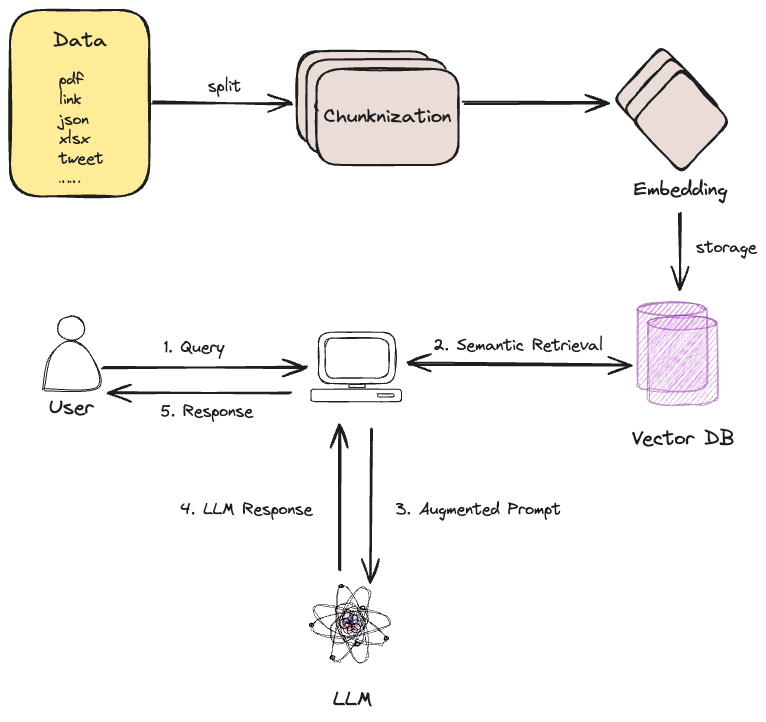

# chainup-chat-bot
基于 RAG 和 Llama3 的私有化聊天机器人。

[简体中文](README-zh.md) | [English](README.md)

# 技术架构
## 架构图


## 关键技术
1. RAG（检索增强生成）是指对大型语言模型输出进行优化，使其能够在生成响应之前引用训练数据来源之外的权威知识库。大型语言模型（LLM）用海量数据进行训练，使用数十亿个参数为回答问题、翻译语言和完成句子等任务生成原始输出。在 LLM 本就强大的功能基础上，RAG 将其扩展为能访问特定领域或组织的内部知识库，所有这些都无需重新训练模型。这是一种经济高效地改进 LLM 输出的方法，让它在各种情境下都能保持相关性、准确性和实用性。 
   1. [Retrieval-Augmented Generation for Knowledge-Intensive NLP Tasks](https://arxiv.org/abs/2005.11401)
   2. [什么是 RAG（检索增强生成）？](https://aws.amazon.com/cn/what-is/retrieval-augmented-generation/)
2. [Ollama](https://github.com/ollama/ollama) 快速启动和运行大模型的框架。
3. [Llama3 8B](https://llama.meta.com/llama3/) Meta 开源的大模型.
4. [LangChain](https://www.langchain.com/) 帮助开发者轻松地构建基于大语言模型（LLM）的应用程序。

# 使用

## 环境搭建

1. 安装 python 依赖
```sh
pip install dspy gradio langchain langchain_community langchain_core langchain_huggingface pypdf fastembed chromadb sentence-transformers pandas openpyxl
```

2. Ollama 操作

参看：[https://github.com/ollama/ollama](https://github.com/ollama/ollama)
```sh
# 1. 安装Ollama: https://github.com/ollama/ollama

# 2. 运行ollama
ollama serve

# 3. 下载模型
ollama pull llama3

# 4. 运行大模型（可选）
ollama run llama3
```

## 准备数据
支持的数据类型：
1. json（training_jsons）
2. pdf（training_pdfs）
3. xlsx（training_xlsx）
4. tweets @see [https://github.com/chainupcloud/twitter-scan](https://github.com/chainupcloud/twitter-scan)

## 数据加载到向量数据库 ChromaDB
```python
# 将xlsx文件转换为json
python training_xlsx_to_json.py

# 创建本地ChromaDB（项目根目录下 /db）
python create_chroma_collection.py

# 将训练数据加载到ChromaDB（可随时新加入文件）
python load_data.py
```

## 运行 Chatbot
```python
python chatbot.py
```

运行后，打开浏览器访问：http://localhost:7860，自带 Web UI 界面。


